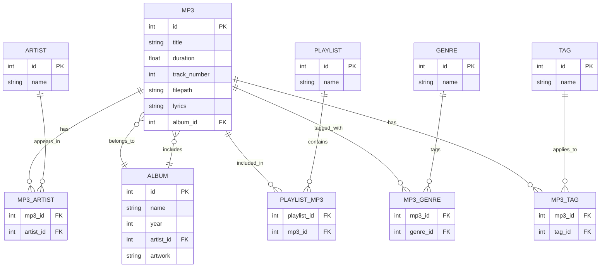

```mermaid
erDiagram
    MP3 ||--o{ MP3_ARTIST : has
    ARTIST ||--o{ MP3_ARTIST : appears_in
    MP3 }o--|| ALBUM : belongs_to
    ALBUM ||--o{ MP3 : includes
    MP3 ||--o{ PLAYLIST_MP3 : included_in
    PLAYLIST ||--o{ PLAYLIST_MP3 : contains
    MP3 ||--o{ MP3_GENRE : tagged_with
    GENRE ||--o{ MP3_GENRE : tags
    MP3 ||--o{ MP3_TAG : has
    TAG ||--o{ MP3_TAG : applies_to
    MP3 {
        int id PK
        string title
        float duration
        int track_number
        string filepath
        string lyrics
        int album_id FK
    }
    ARTIST {
        int id PK
        string name
    }
    ALBUM {
        int id PK
        string name
        int year
        int artist_id FK
        string artwork
    }
    MP3_ARTIST {
        int mp3_id FK
        int artist_id FK
    }
    PLAYLIST {
        int id PK
        string name
    }
    PLAYLIST_MP3 {
        int playlist_id FK
        int mp3_id FK
    }
    GENRE {
        int id PK
        string name
    }
    MP3_GENRE {
        int mp3_id FK
        int genre_id FK
    }
    TAG {
        int id PK
        string name
    }
    MP3_TAG {
        int mp3_id FK
        int tag_id FK
    }
```